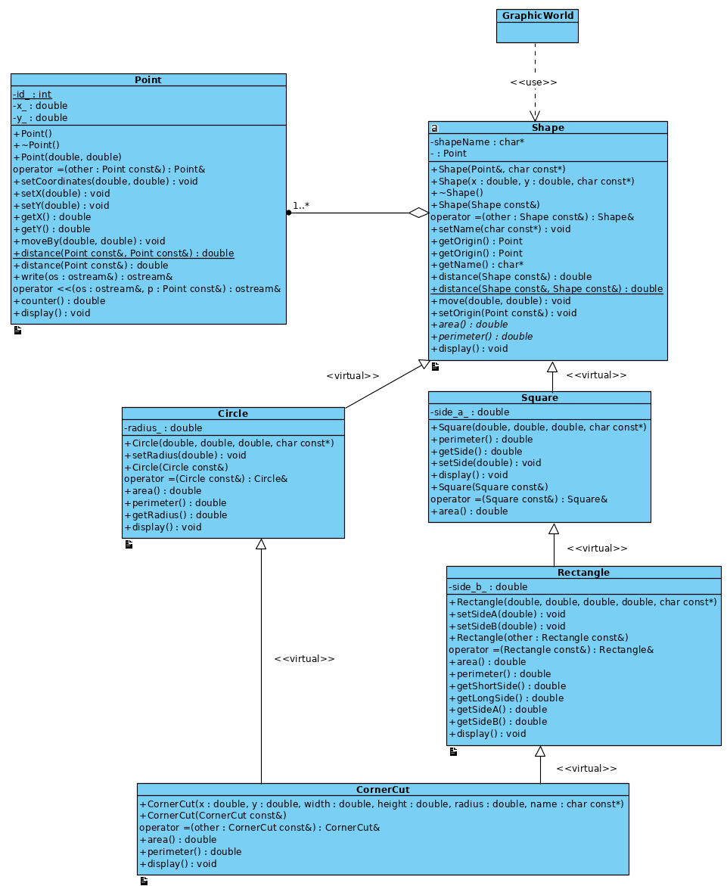

# Multiple inheritance exercise in C++
ENSF607 Winter 2020 Assignment on C++ polymorphism and inheritance concepts

Once the assignment is handed in this will become a public repo.

<<<<<<< HEAD

=======

>>>>>>> f48c17e9605e4ec0154555f4bf280ef02345dcb2
